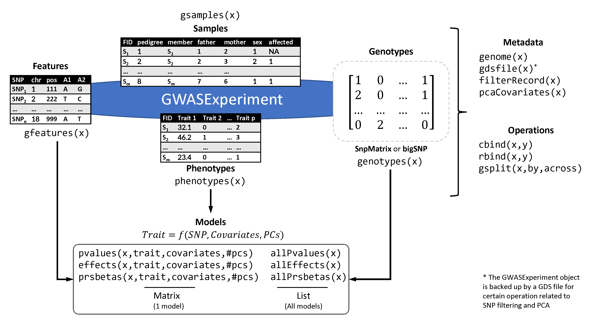

# The GWASExperiment class

The following subsections outline the main data object used throughout the
package for various data interchange and package functions.

## Description and structure

The main data structure of PRISMA is the GWASExperiment class which briefly 
provides facilities for:

* Data import using facilities from the Bioconductor package 
[snpStats](https://www.bioconductor.org/packages/release/bioc/html/snpStats.html).
* Data integrity checks, data selections as well as recording of metadata 
gathered during analysis steps, such as filtering result tracking and Principal
Component Analysis.
* Robust Principal Component Analysis for automatic exclusion of outlier 
samples (through the R package 
[rrcov](https://cran.r-project.org/web/packages/rrcov/index.html).
* Automatic selection of informative PCs to be used as population stratification 
covariates in subsequent GWAS and PRS analyses using the Tracy-Widom statistic.
* Quality Control and filtering of GWAS data at the genotype level based on:
    - SNP call rate.
    - Minor Allele Frequency and monomorphic markers (MAF).
    - Hardy-Weinberg equilibrium (HWE).
    - Linkage Disequilibrium pruning (LD).
* Quality Control and filtering of GWAS data at the sample level (using 
genotypic data) based on:
    - Sample call rate.
    - Heterozygosity.
    - Identity By Descent (IBD, preceded by LD pruning).
    - Outlier filtering based on robust PCA preceded by LD pruning.
* Missing value imputation (not to be confused with imputation of genotypes 
based on external panels such as 1000 genomes) based on a multi-step process 
comprising:
    - Iterative imputation using facilities from snpStats package (regression 
    of each SNP with nearby ones and extraction of imputation rules).
    - For the remaining missing values, imputation using the R package scrime, 
    specialized on missing value imputation for genotypic data.
* Slots which hold marker calculated effects and statistical significance 
(p-values) from the application of one or multiple GWA tests, for any number of 
association tests (e.g. using different covariates).
* Facilities for combining the outcome of multiple GWA tests (p-value 
combination methods).
* Slots which hold the outcome of the PRS extraction outcomes (effects or 
adjusted betas).

Apart from the GWASExperiment class, PRISMA deploys additional simpler 
structures with the goals of 

i. Grouping results in a way useful for reporting.
ii. Harmonizing the PRS candidate SNP format and accompanying details in a 
format similar to the scores format of the PGS Catalog.

Finally, the aforementioned missing value imputation process was found to be 
between 88% and 92% accurate in imputing known genotypes (data not shown in 
this report).

## Object design

The GWASExperiment class is a direct extension of the 
[SummarizedExperiment](https://bioconductor.org/packages/release/bioc/html/SummarizedExperiment.html)
class, with additional slots to host phenotypes, statistical outcomes, effects
used to weight the PRS candidates and certain metadata. Below, the main 
extensions are summarized (for more information please see the related man 
page):

* The `rowData` slot/accessor of the `SummarizedExperiment` is renamed to 
`gfeatures` (`rowData` can still be used but no formatting checks are performed 
which may cause crashes) and is a `DataFrame` with SNP data similar to the 
contents of the PLINK `bim` files, imported with `snpStats`.
* The `colData` slot/accessor of the `SummarizedExperiment` is renamed to 
`gsamples` (`colData` can still be used as above) and is a `DataFrame` with SNP 
data similar to the contents of the PLINK `fam` files, imported with `snpStats`.
* The `assays` and `assay` slot/accessor of the `SummarizedExperiment` is 
extended to `genotypes` (`assay`, `assays` can still be used) and checks are
performed with respect to the genotype format.
* The `metadata` slot/accessor of the `SummarizedExperiment` does not have
completely free content and must at least contain some information about the
data such as genome version and applied filters.
* It hosts additional data parallel to `gfeatures` and `gsamples`:
    - The `phenotypes` slot/accessor hosts phenotypic or other measurements for
    each sample and is parallel to `gsamples`.
    - The `pvalues`, `effects`, `prsbetas` slots/accessors hosts statistical
    scores from GWA tests (`pvalues`, `effects`) or PRS extraction algorithms 
    (`prsbetas`) for each SNP/feature and is parallel to `gfeatures`. These
    slots are lists (`SimpleList`) with as many members as the number of 
    different models tested (e.g. with different covariates, number of PCs). In
    this way, the whole `GWASExperiment` object is not replicated while 
    maintaining information on many models.
    - `allPvalues`, `allEffects`, `allPrsbetas` can be used to retrieve the
    totality of the respective scores for all models associated with a
    `GWASExperiment` object.
* Other accessors and purpose-related functions are `genome` to get/set the
genome version of the `gfeatures`, `pcaCovariates` to get/set the PCs calculated
over the `GWASExperiment` object data, `gsplit` to split the object feature- or
sample-wise according to variables present to features or samples and others
mentioned in the respective man page.
* Combining functions (`cbind`, `rbind`) are also supported.

The following figure summarizes the `GWASExperiment` object structure:

```{r img-0, echo=FALSE, out.width = "600px"}

```

## Examples

The following sections show some examples of usage of the `GWASExperiment`
objects including their creation and function.

```{r gwe-0, eval=TRUE, echo=FALSE, tidy=FALSE, message=FALSE, warning=FALSE}
library(prisma)
```

### GWASExperiment from simulated data

We create some simulated data with 100 SNPs, 10 samples and 10 causative SNPs 
for speed and simplicity. We also add pseudo-effects and pseudo-pvalues from two
virtual GWA tests to demonstrate the slots of the object. The genome is unknown.

```{r gwe-1, eval=TRUE, echo=TRUE, tidy=FALSE, message=TRUE, warning=FALSE, collapse=TRUE}
dat1 <- makeSimData(nsnp=100,nsam=10,nphe=3,csnp=10)

# Simple GWASExperiment object
gwe1 <- GWASExperiment(
    genotypes=dat1$snp,
    features=dat1$feature,
    samples=dat1$sample,
    phenotypes=dat1$pheno
)

# With pseudo-effects and pseudo-pvalues
pspval <- matrix(runif(200),100,2)
rownames(pspval) <- rownames(dat1$snp)
colnames(pspval) <- c("test1","test2")

# Pseudo-effects and directions
pseff <- matrix(runif(200,min=0,max=2),100,2)
dire <- matrix(FALSE,100,2)
dire[sample(nrow(dire),50),1] <- TRUE
dire[sample(nrow(dire),50),2] <- TRUE
pseff[dire[,1],1] <- -pseff[dire[,1],1]
pseff[dire[,2],2] <- -pseff[dire[,2],2]
rownames(pseff) <- rownames(dat1$snp)
colnames(pseff) <- c("test1","test2")

# Assign effects and p-values to the object, assuming a model
# with 'Trait_1' as response and 'Trait_2', 'Trait_3' as
# covariates has been fit (no PCs)
pvalues(gwe1,response="Trait_1",
    covariates=c("Trait_2","Trait_3")) <- pspval
effects(gwe1,response="Trait_1",
    covariates=c("Trait_2","Trait_3")) <- pseff

gwe1
```

We create an additional simulated dataset to demonstrate joining and splitting
operations.

```{r gwe-2, eval=TRUE, echo=TRUE, tidy=FALSE, message=TRUE, warning=FALSE, collapse=TRUE}
# Add SNPs (rbind)
dat2 <- makeSimData(nsnp=100,nsam=10,nphe=3,csnp=10)
rownames(dat2$snp) <- rownames(dat2$feature) <- 
    paste("snp",101:200,sep="_")
gwe2 <- GWASExperiment(
    genotypes=dat2$snp,
    features=dat2$feature,
    samples=dat1$sample,
    phenotypes=dat1$pheno
)
# p-values and effects will be dropped with warning
gwe12 <- suppressWarnings(rbind(gwe1,gwe2))

gwe12

# Add samples (cbind)
dat3 <- makeSimData(nsnp=100,nsam=10,nphe=3,csnp=10)
rownames(dat3$sample) <- rownames(dat3$pheno) <- 
    colnames(dat3$snp) <- paste("sample",11:20,sep="_")
gwe3 <- GWASExperiment(
    genotypes=dat3$snp,
    features=dat1$feature,
    samples=dat3$sample,
    phenotypes=dat3$pheno
)
# p-values and effects will be dropped with warning
gwe13 <- suppressWarnings(cbind(gwe1,gwe3))

gwe13
```

It is important to note that when merging datasets via `cbind` or `rbind` the
following changes are made with respect to the final object:

* Any statistical GWA/PRS operations and scores are dropped. p-values, effects
and PRS betas do no longer have meaning as either the tested SNPs or the number
of samples changes.
* In the case of change of sample number (`cbind`), principal components are
also dropped. We do not drop them in `rbind` as they still might be of usage
but they can be recalculated.
* The drop of PCs also applies in subsetting.
* `metadata` are merged. If of importance, you should check the outcome and
adjust accordingly.
* The genome versions of the combining objects must be identical.

### GWASExperiment from PLINK files

We use the example files shipping with the `snpStats` package:

```{r gwe-3, eval=TRUE, echo=TRUE, tidy=FALSE, message=TRUE, warning=FALSE, collapse=TRUE}
fam <- system.file("extdata/sample.fam",package="snpStats")
bim <- system.file("extdata/sample.bim",package="snpStats")
bed <- system.file("extdata/sample.bed",package="snpStats")
input <- list(fam=fam,bim=bim,bed=bed)
```

Without phenotypes:

```{r gwe-4, eval=TRUE, echo=TRUE, tidy=FALSE, message=TRUE, warning=FALSE, collapse=TRUE}
gwe <- importGWAS(input,backend="snpStats")

gwe
```
    
With phenotypes

```{r gwe-5, eval=TRUE, echo=TRUE, tidy=FALSE, message=TRUE, warning=FALSE, collapse=TRUE}
set.seed(42)

fam <- system.file("extdata/sample.fam",package="snpStats")
bim <- system.file("extdata/sample.bim",package="snpStats")
bed <- system.file("extdata/sample.bed",package="snpStats")
input <- list(fam=fam,bim=bim,bed=bed)
sample <- snpStats::read.plink(input$bed,input$bim,input$fam)

pseudopheno <- data.frame(
    case_control=sample(c(0,1),nrow(sample$fam),replace=TRUE),
    other_pheno=sample(c("drug","nodrug"),nrow(sample$fam),replace=TRUE),
    cont=round(runif(nrow(sample$fam)),3),
    row.names=rownames(sample$fam)
)
gwe <- importGWAS(input,phenos=pseudopheno,backend="snpStats")

gwe
```

# R session info

```{r session-0, eval=TRUE, echo=TRUE, tidy=FALSE, message=TRUE, warning=FALSE}
sessionInfo()
```
