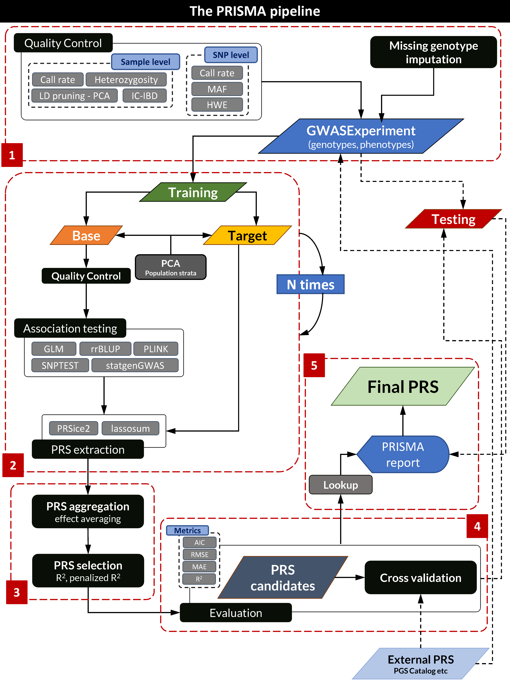

# Introduction

Although the individual steps of a PRS extraction process can be performed in
a stepwise manner, PRISMA was designed to offer complete RPS extraction 
pipelines with evaulation and related visualizations. The results of the 
iterative PRS extraction as well as the evaluation metrics and the reports are
registered to an object alltogether which facilitates reporting. This is not as
easily possible when using individual steps. In addition, as the whole process
involves many complex steps and inclusion of external software, it may be prone
to crashes. The pipelines implement several checkpoints that can be used to
restart the pipeline from the crash point (if any). Furthermore, there is a
pipeline wrapper which iteratively executes the selected pipeline until 
finished.

The main steps implemented in the PRISMA pipelines which offer an end-to-end PRS
extraction pipeline are:

1. Preparation of the main total dataset consisting of basic quaility control
filtering and missing genotype imputation. Optionally, holding-out a completely
independent object to be used for evaluation.
2. Iterative PRS extraction consising of
    a. Splitting of the main `GWASExperiment` in a base (training) object which
    will be used for summary statistics and a target (test) object which will be
    used for PRS extraction and evaluation.
    b. Quality control of the base object, essentially for filtering out SNPs
    with small MAF and possibly violating HWE after the dataset splitting. 
    Further sample filtering is also possible. PCA is optionally performed in
    both base and target objects.
    c. Calculation of summary statistics with many available methods using the
    base object.
    d. Derivation of PRS using the summary statistics of (2c) and the target
    object, with more than one available methods.
3. Aggregation of the SNPs suggested in the iterative PRS extraction process and
summarization of SNP effects, followed by semi-automatic selection of the best
PRS candidates.
4. Evaluation of the PRS candidates using the total dataset and/or optionally
the independent testing samples held-out. In this step, an externally retrieved
PRS (e.g. from PGS Catalog) can be plugged in for evaluation.
5. Lookup of the SNPs included in the final PRS candidates to annotate from
online resources for known traits (GWAS Catalog) followed by reporting and the
selection of the final PRS.

The main PRISMA pipeline is depicted in the following figure:

```{r img-0, echo=FALSE, out.width = "800px"}

```

# PRISMA pipelines

At the heart of the PRISMA pipelines is the main `prisma()` wrapper, along with
other functions that implement the steps such as `prsPipeline()`, 
`prsSelection()`, `selectPrs()` and other validation functions such as 
`prismaCrossValidate()`. Parallelization is implemented wherever possible. The
following subsections present the different PRISMA pipelines which implement
the PRS extraction and evaluation steps outlined above.

```{r pip-0, eval=TRUE, echo=FALSE, tidy=FALSE, message=FALSE, warning=FALSE}
library(prisma)
```

## De novo PRS derivation pipeline

This is the main PRS candidate extraction pipeline and performs the following 
steps:
1. Split of the input data object to a usually larger training set and a smaller 
independent test set.
2. De novo quality control on the training and test sets as well as optional PCA 
in the training set to capture local population structure to be used as 
covariates in the subsequent GWA tests.
3. Execution of GWA tests against a phenotype using one or more of the supported 
methods to extract summary statistics (SNP effects and p-values).
4. Execution of one or more PRS extraction algorithms to derive PRS candidate 
SNPs.

Steps (1) – (4) are executed N times with different training and test sets to 
capture as much variation in the selection process as possible. Subsequently:

5. The candidate SNPs from PRSs extracted at each iteration are aggregated and 
the frequency of their appearance is recorded. At the same time, new effects are 
calculated either by averaging the SNP effects from each iteration, a 
[statistically valid process](https://www.biorxiv.org/content/10.1101/133785v8.full.pdf) 
which generally corrects for overfitting, or by weighted averaging of the 
effects based on the performance of PRSs constructed at each iteration (as 
measured by the adjusted PRS R<sup>2</sup> returned by PRSice2).

Here, `prsPipeline()` produces a list either with `GWASExperiment` objects with
the `prsbetas` and `effects` or summary lists, not holding the genotypic data
for saving memory and space. This list practically hold the derived PRSs in each
iteration, through the `prsbetas` slot.

```{r pip-1, eval=TRUE, echo=TRUE, tidy=FALSE, message=TRUE, warning=FALSE, collapse=TRUE}
library(prisma)

data(toy,package="prisma")
gdsfile(toy) <- system.file(package="prisma","extdata","toy.gds")

# Lose filters for the toy dataset
filts <- getDefaults("filters")
filts$IBD <- NA
filts$hwe <- 1e-3
filts$pcaOut <- FALSE
filts$inbreed <- NA

# Traits
response <- "BMI"
covariates <- c("Case_Control","Gender","Age")

d1 <- tempfile()
wspace1 <- file.path(tempdir(),d1)
if (Sys.which("PRSice_linux") != "") {
    dnList <- prsPipeline(
        gwe=toy,
        phenotype=response,
        covariates=covariates,
        pcs=FALSE,
        trainSize=0.8,
        niter=4,
        filters=filts,
        pcaMethod="snprel",
        imputeMissing=FALSE,
        gwaMethods="statgen",
        prsiceOpts=list(clump_p=0.75,perm=100),
        prsWorkspace=wspace1,
        cleanup="intermediate",
        logging="file",
        rc=0.25
    )
}
```

Now, aggregate the outcome to a pool of SNPs to be evaluated for PRS candidates:

```{r pip-2, eval=TRUE, echo=TRUE, tidy=FALSE, message=TRUE, warning=FALSE, collapse=TRUE}
snpSummary <- aggregatePrsMarkers(dnList,mode="intersect",qcut=0)

head(snpSummary)
```

## PRS evaluation pipeline based on the original train/test split with PRSice2

This pipeline is similar to the de novo PRS evaluation pipeline but it uses the 
initial train/test split described above for PRS evaluation. The steps are 
similar to those described above and the evaluation is performed with the 
PRSice2 framework, limiting somehow the available model evaluation metrics. 
Also, averaged SNP effects are used. In the example below, we provide a PRS
candidate (`snpSelection` argument) based on the previous example, with SNPs
appearing more than 1 time. We also request the evaluation to be performed in
the same split set (`useDenovoWorkspace` argument).

```{r pip-3, eval=TRUE, echo=TRUE, tidy=FALSE, message=TRUE, warning=FALSE}
snpSelection <- snpSummary[snpSummary$freq>1,]

d2 <- tempfile()
wspace2 <- file.path(tempdir(),d2)
if (Sys.which("PRSice_linux") != "") {
    out <- prsPipeline(
        gwe=toy,
        phenotype=response,
        covariates=covariates,
        pcs=FALSE,
        trainSize=0.8,
        niter=4,
        filters=filts,
        pcaMethod="snprel",
        imputeMissing=FALSE,
        snpSelection=snpSelection,
        gwaMethods="statgen",
        prsiceOpts=list(clump_p=0.75,perm=100),
        prsWorkspace=wspace2,
        cleanup="intermediate",
        logging="file",
        evalWith="prsice",
        useDenovoWorkspace=dnList,
        rc=0.25
    )
}
```

The `out` argument is a list of data frames containing a more elegant format of
the SNPs in `snpSelection`. Since we requested evaluation with PRSice2, each
data frame has a list of attributes attached to it, summarizing this evaluation:

```{r pip-4, eval=TRUE, echo=TRUE, tidy=FALSE, message=TRUE, warning=FALSE, collapse=TRUE}
attributes(out[[1]])
```

The `PR2` attribute contains the PRsice2 evalutation metrics which are not
identical between two outputs as they refer to different dataset splits in
training and testing.

```{r pip-5, eval=TRUE, echo=TRUE, tidy=FALSE, message=TRUE, warning=FALSE}
identical(attr(out[[1]],"PR2"),attr(out[[2]],"PR2"))
```

These metrics are properly gathered and returned by the `prsSelection()` 
function.

## PRS evaluation pipeline based on the original train/test split with R

Again, this pipeline is similar to the one described above but this time 
evaluation is done with native R functions (manual PRS construction outside 
PRSice2 followed by GLM regressions). This is the fastest evaluation pipeline 
and allows for the collection of many additional metrics. We change the
`evalWith` argument to `"vanilla"` which is also the default.

```{r pip-6, eval=TRUE, echo=TRUE, tidy=FALSE, message=TRUE, warning=FALSE, collapse=TRUE}
snpSelection <- snpSummary[snpSummary$freq>1,]

d3 <- tempfile()
wspace3 <- file.path(tempdir(),d3)

out <- prsPipeline(
    gwe=toy,
    phenotype=response,
    covariates=covariates,
    pcs=FALSE,
    trainSize=0.8,
    niter=4,
    filters=filts,
    pcaMethod="snprel",
    imputeMissing=FALSE,
    snpSelection=snpSelection,
    gwaMethods="statgen",
    prsWorkspace=wspace3,
    cleanup="intermediate",
    logging="file",
    evalWith="vanilla",
    useDenovoWorkspace=dnList,
    rc=0.25
)
```

This time out is a list of data frames with the collected evaluation metrics.
These are described in detail in the respective man pages.

```{r pip-7, eval=TRUE, echo=TRUE, tidy=FALSE, message=TRUE, warning=FALSE, collapse=TRUE}
m <- do.call("rbind",out)

m
```

These metrics are properly gathered and returned by the `prsSelection()` 
function.

## De novo PRS evaluation pipeline

This evaluation pipeline differs from the other two in that it creates a new 
dataset split with related preprocessing and thus taking much more time than
the other two. See also the Introduction vignette for more details on this
process. It is controlled by the lack of the `useDenovoWorkspace` argument or
`useDenovoWorkspace=NULL`. Evaluation is done with PRSice2 resulting in a list
of data frames with attributes as above.


```{r pip-8, eval=TRUE, echo=TRUE, tidy=FALSE, message=TRUE, warning=FALSE, collapse=TRUE}
snpSelection <- snpSummary[snpSummary$freq>1,]

d4 <- tempfile()
wspace4 <- file.path(tempdir(),d4)

if (Sys.which("PRSice_linux") != "") {
    out <- prsPipeline(
        gwe=toy,
        phenotype=response,
        covariates=covariates,
        pcs=FALSE,
        trainSize=0.8,
        niter=4,
        filters=filts,
        pcaMethod="snprel",
        imputeMissing=FALSE,
        snpSelection=snpSelection,
        gwaMethods="statgen",
        prsiceOpts=list(clump_p=0.75,perm=100),
        prsWorkspace=wspace3,
        cleanup="intermediate",
        logging="file",
        rc=0.25
    )
}
```

The evaluation metrics are properly gathered and returned by the 
`prsSelection()` function.

## Wrapping the evaluation process with `prsSelection()`

As mentioned, PRISMA tries to select the best PRS candidates by subsetting the
aggregated SNPs and iteratively evaluating. More precisely the `prsSelection()` 
function is responsible for the following:

1. Create sets of PRS candidates from aggregated PRS extraction SNPs based on:
    a. Fixed quantiles of the frequency distribution (e.g. 10%, 20%, 30%, 40%, 
    50%, 60%, 75%, 80%, 90%, 95%, 99%).
    b. A stepwise set creation process based on frequency of appearance, i.e. 
    each set contains SNPs that appear 5, 6, … up to the maximum number of 
    appearances.
2. For each set created at (1), run an evaluation pipeline and collect 
evaluation metrics in a format proper for downstream analysis.

```{r pip-9, eval=TRUE, echo=TRUE, tidy=FALSE, message=TRUE, warning=FALSE, collapse=TRUE}
d5 <- tempfile()
wspace5 <- file.path(tempdir(),d5)

evalMetrics <- prsSelection(
    dnList=dnList,
    gwe=toy,
    phenotype=response,
    covariates=covariates,
    pcs=FALSE,
    trainSize=0.8,
    niter=4,
    resolution="frequency",
    minSnps=2,
    filters=filts,
    pcaMethod="snprel",
    imputeMissing=FALSE,
    gwaMethods="statgen",
    prsWorkspace=wspace5,
    cleanup="intermediate",
    logging="file",
    output="summary",
    useDenovoWorkspace=dnList,
    rc=0.25
)
```

`evalMetrics` is a list with contents used by the subsequent `selectPrs()`
function:

```{r pip-10, eval=TRUE, echo=TRUE, tidy=FALSE, message=TRUE, warning=FALSE, collapse=TRUE}
candidates <- selectPrs(
    metrics=evalMetrics$metrics,
    snpSelection=evalMetrics$pgs,
    gwe=toy,
    base=evalMetrics$baseline
)
```

The `candidates` variable is a list of candidate PRSs.

```{r pip-11, eval=TRUE, echo=TRUE, tidy=FALSE, message=TRUE, warning=FALSE, collapse=TRUE}
head(candidates[[1]])
```

## Wrapping the whole process with the `prisma()` function

The aforementioned processes can be executed with the `prisma()` function. This
will output a list object with the PRS candidates and evaluatiom metrics which
is then fed to cross-validation, lookup and reporting procedures.

```{r pip-12, eval=TRUE, echo=TRUE, tidy=FALSE, message=TRUE, warning=FALSE, collapse=TRUE}
# Workspace
d6 <- tempfile()
wspace6 <- file.path(tempdir(),d6)

# Complete 4-iteration PRS pipeline - ~1 min to run with 4 cores - no PCA
if (Sys.which("PRSice_linux") != "") {
    prismaOut <- prisma(
        gwe=toy,
        phenotype=response,
        covariates=covariates,
        pcs=FALSE,
        trainSize=0.8,
        niter=4,
        resolution="frequency",
        minSnps=2,
        filters=filts,
        pcaMethod="snprel",
        imputeMissing=FALSE,
        gwaMethods=c("glm","statgen"),
        prsiceOpts=list(clump_p=0.75,perm=100),
        prsWorkspace=wspace6,
        cleanup="intermediate",
        logging="file",
        output="normal",
        rc=0.25
    )
}
```

# PRS candidate evaluation, lookup and reporting

After the completion of the PRISMA pipeline, we are using the total dataset to
evaluate the candidates. We also lookup for the SNP content in GWAS Catalog and
finally report the results in an HTML report.

```{r pip-13, eval=TRUE, echo=TRUE, tidy=FALSE, message=TRUE, warning=FALSE, collapse=TRUE}
cvMetrics <- prismaCrossValidate(
    prismaOut=prismaOut,
    gwe=toy,
    response=response,
    covariates=covariates,
    pcs=FALSE,
    leaveOut=c(0.1,0.25,0.5),
    rc=0.25
)
```

`cvMetrics` is a list of validation metrics used with the reporting function.
You may inspect it but it has not great meaning outside the report.

```{r pip-14, eval=TRUE, echo=TRUE, tidy=FALSE, message=TRUE, warning=FALSE, collapse=TRUE}
lookup <- prismaLookup(prismaOut)
```
   
Similarly, `lookup` is a list with findings on GWAS Catalog, regarding the SNP
content of the PRS candidates and potential associated traits.

Finally, create the report:

```{r pip-15, eval=FALSE, echo=TRUE, tidy=FALSE, message=TRUE, warning=FALSE, collapse=TRUE}
prismaReport(toy,prismaOut,cvMetrics,lookup)
```

## Wrapping the whole process with the `prismaPipeline()` function

The difference with the `prisma()` function is that the `prismaPipeline()` 
function wraps the `prisma()` call, the calculation of evaluation and
cross-validation metrics, the lookup and report. The report will be written in
`outPath`.

```{r pip-16, eval=FALSE, echo=TRUE, tidy=FALSE, message=FALSE, warning=FALSE, collapse=TRUE}
outPath <- file.path(tempdir(),tempfile())
d7 <- tempfile()
wspace7 <- file.path(outPath,d7)

prismaPipeline(
    gwe=toy,
    phenotype=response,
    covariates=covariates,
    pcs=FALSE,
    trainSize=0.8,
    niter=4,
    resolution="frequency",
    minSnps=2,
    filters=filts,
    pcaMethod="snprel",
    imputeMissing=FALSE,
    gwaMethods=c("glm","statgen"),
    prsiceOpts=list(clump_p=0.75,perm=100),
    prsWorkspace=wspace4,
    cleanup="intermediate",
    logging="file",
    output="normal",
    rc=0.25,
    outPath=outPath
)
```

The output report for this case is shown embedded below. Plese **note** that
this is **not** a realistic report. The normal one is richer and with more
PRS candidates to evaluate.

```{r bro-1, eval=FALSE, echo=TRUE}
browseURL(paste0("file://",outPath,"index.html"))
```

# R session info

```{r session-0, eval=TRUE, echo=TRUE, tidy=FALSE, message=TRUE, warning=FALSE}
sessionInfo()
```
