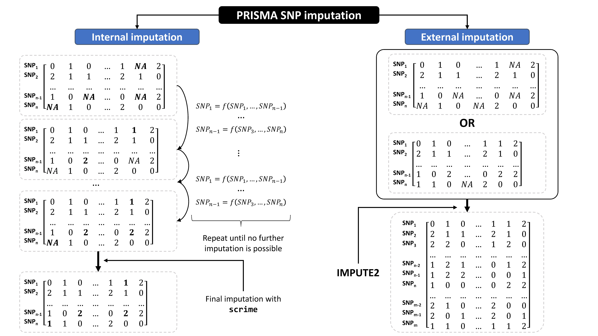
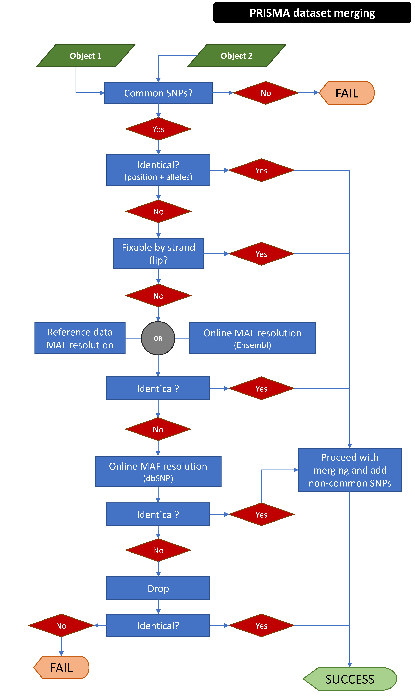

# SNP imputation in PRISMA

PRISMA offers functions to perform SNP genotype imputation at two levels. The 
first level is imputation of missing genotypes, for completeness of a dataset as
many GWA tests do not operate with missing values. This is different from SNP 
imputation based on a large reference panel such as a population study (e.g. 
the 1000 genomes project). We refer to this imputation level as *internal 
imputation*. The second level is the imputation based on an external reference
panel (as mentioned before). In this case, the genotypes are both imputed (in 
the case of missing data) and extended to infer SNPs and other variants not
present in the initial dataset, based on the content of the initial dataset and
sophisticated regression algorothims which use the reference panel and the 
actual dataset content to enrich the initial dataset with inferred SNPs with
usually good accuracy. We refer to this level of imputation as *external 
imputation* or *extension*.

To achieve the two types of imputation PRISMA utilizes:

* For internal imputation, it implements a sequential imputation procedure based
on the `snp.impute` function of the package snpStats, followed by genotype
imputation with the package scrime for SNPs that fail to be imputed.
* For external imputation, it wraps the 
[IMPUTE2](https://mathgen.stats.ox.ac.uk/impute/impute_v2.html) algorithm and
extends the `gfeatures` slot of the initial `GWASExperiment` object with the
INFO score returned by IMPUTE2 and can be used to assess the quality of the 
extended genotypes and filter accordingly.

## Internal imputation

```{r imp-0, eval=TRUE, echo=FALSE, tidy=FALSE, message=TRUE, warning=FALSE}
library(prisma)
```

As mentioned, internal imputation in PRISMA is performed by implementing a
sequential imputation process using functions from the snpStats package. 
Therefore, the imputation can be performed in two possible ways:

i. Imputing with imputation rules based on the total dataset with or without
missing values (`mode="single"`). Rules are created based on all SNPs in the 
dataset even if there are some missing values (snpStats takes care of that).
ii. Imputing with spliting the dataset to a part with non-missing genotypes
which is used to create the imputation rules (mode="split"), which are then 
applied on the dataset part with the missing values. 

Even though case (ii) may be more accurate, it is often non-applicable to 
smaller datasets where it is unlikely to find samples with no missing values at
all. Case (ii) could also be applied with an external reference panel to add
SNPs not genotyped in the initial dataset (another *external* imputation 
process) which is not implemented within PRISMA at this point.

All the functionalities are wrapped with the `imputeGWAS()` function which
operates on a `GWASExperiment` object. Below, we are using again the toy dataset 
included with PRISMA and we will artificially add a few missing values to 
demostrate case (i) (`mode="single"`):

```{r imp-1, eval=TRUE, echo=TRUE, tidy=FALSE, message=TRUE, warning=FALSE, collapse=TRUE}
data(toy,package="prisma")

# Make some genotypes missing
set.seed(42)
toMiss <- lapply(seq_len(ncol(toy)),function(j) {
    n <- sample(20,1)
    miss <- logical(nrow(toy))
    miss[sample(nrow(toy),n)] <- TRUE
    return(miss)
})

G <- as(genotypes(toy),"numeric") + 1
mode(G) <- "integer"
for (j in seq_len(ncol(toy)))
    G[toMiss[[j]],j] <- 0L
G <- SnpMatrix(G)
genotypes(toy) <- G

toyI <- imputeGWAS(toy,fail="none")
before <- length(which(is.na(genotypes(toy))))
after <- length(which(is.na(genotypes(toyI))))
before > after # TRUE
```

The imputation process can be parallelized with the `rc` argument passed to the
`imputeGWAS()` function. The `fail` argument controls what to do with genotypes
that failed to be imputed with the snpStats imputation rules. They either remain
missing (`fail="none"`) or they are further imputed with the k-Nearest Neighbor
algorithm implemented in the package scrime (`fail="scrime"`). It should be 
noted that some form of imputation *must* be performed prior to GWA tests and 
PRS analysis as many algorithms do not handle missing genotypes.

Also, internal imputation is part of the filtering process so as to procude
objects ready for GWA testing. It can be turned off by setting 
`imputeMissing=FALSE` in the `filterGWAS()` function. This should be the case
when playing with filters to bring data to acceptable form for later analysis.

## External imputation

As mentioned, *external imputation* in PRISMA refers to the extension of the
dataset (e.g. SNP microarray) content with SNPs and other variants that do not
exist in it, based on an external larger reference population panel such as the
variants listed within the 
[1000 Genomes Project](https://www.internationalgenome.org/). This process is
called *imputation* in the related literature but within PRISMA and in order to
distinguish it from missing genotype imputation, we refer to it as *extension*
or *external imputation*.

To perform external imputation PRISMA needs:

* The [IMPUTE2](https://mathgen.stats.ox.ac.uk/impute/impute_v2.html) software
* The [IMPUTE2 reference panel files](https://mathgen.stats.ox.ac.uk/impute/1000GP_Phase3.tgz)
* The [GTOOL](https://www.well.ox.ac.uk/~cfreeman/software/gwas/gtool.html) or
[QCTOOL](https://www.well.ox.ac.uk/~gav/qctool_v2/) tools for file conversion
operations.

IMPUTE2 by default imputes SNPs over shorter intervals and not over chromosomes.
Briefly, the `extendGWAS()` function:

* Converts and exports the input `GWASExperiment` object to files that IMPUTE2 
can understand
* Creates the imputation intervals over the chromosomes present in the initial
object
* Paralelly (if possible) executes IMPUTE2 over the imputation intervals
* Merges the produced files per chromosome and converts to PLINK format so that
they can be read back to a `GWASExperiment`
* Creates a merged and extended `GWASExperiment` object with the imputed SNPs
and adds the imputation `INFO` score (imputation accuracy) to the `gfeatures` of
the object
* Cleans up

The following will perform imputation with writing intermediate files to a
temporaray folder without removing intermediate files:

```{r imp-2, eval=FALSE, echo=TRUE, tidy=FALSE, message=TRUE, warning=FALSE}
data(toy,package="prisma")

refSpace <- "PATH/TO/IMPUTE2/REFERENCE/PANEL"
toyEx <- extendGWAS(toy,refSpace=refSpace)
```

The following will perform imputation with writing intermediate files to a.
user specified folder, using QCTOOL as conversion tool and leaving some
intermediate files back:

```{r imp-3, eval=FALSE, echo=TRUE, tidy=FALSE, message=TRUE, warning=FALSE}
data(toy,package="prisma")

refSpace <- "PATH/TO/IMPUTE2/REFERENCE/PANEL"
wspace <- "PATH/TO/WORKSPACE"

toyEx <- extendGWAS(toy,wspace=wspace,refSpace=refSpace,convTool="qctool",
    cleanup="intemediate")
```

The following will perform imputation over intervals of 10Mbp (default is 1Mbp):

```{r imp-2, eval=FALSE, echo=TRUE, tidy=FALSE, message=TRUE, warning=FALSE}
data(toy,package="prisma")

refSpace <- "PATH/TO/IMPUTE2/REFERENCE/PANEL"
toyEx <- extendGWAS(toy,intSize=1e+7,refSpace=refSpace)
```

The two conversion tools, GTOOL and QCTOOL are both supported because GTOOL may
not be compatible with some later Linux versions (e.g. > Ubuntu 18.04). 
Generally, the process may require many hours to complete (especially for 
complete datasets) so it would be better to put the command in a script and run
the command in the background with `Rscript`.

The following figure summarizes the imputation modes in PRISMA:

```{r img-0, echo=FALSE, out.width = "600px"}

```

# Dataset merging

With PRISMA, it is possible to merge two genotype datasets, for example datasets
derived from different array platforms or different versions of the same
platform or different arrays from the same provider. Merging is not a
straigh-forward process as there are several factors - apart from the obvious
which is non-common SNPs - such as reversed alleles, multiallelic SNPs with no
sufficient representation of mixes in major and minor alleles between different
datasets. Although there is software dedicated to the merging and harmonization
of different datasets (for example 
[Genotype Harmonizer](https://github.com/molgenis/systemsgenetics/wiki/Genotype-Harmonizer)),
PRISMA facilitates also this process by offering a simple `GWASExperiment` 
merging function so that users do not have to use multiple packages and complex
I/O operations. The merging process is explained below.

## Prerequisites

Generally, some prerequisites are assumed prior to merging:

* The human genome versions of the two object to be merged must be the same. Use
the `guessHumanGenomeVersion()` and `GWASExperimentLiftOver()` functions to 
check and fix such issues where possible.
* The SNP ids from each dataset must be in a common reference format. Ideally,
the ids should be converted to dbSNP ids prior to any processing, as in this
way the merging process can use online resources to resolve issues. Other ids
are also possible like Illumina GSA ids, but online resolving resources cannot
be used.
* SNP locations must be available.

## Merging process

This process is also described in the man page of the `mergeGWAS()` function.

The following figure summarizes the imputation modes in PRISMA:

```{r img-1, echo=FALSE, out.width = "600px"}

```


### Common SNPs
    
If the two datasets are compatible in terms of genome version and coordinates, 
the common SNPs are then identified between the two datasets. As these must
point to the same information (location, minor and major alleles, same strand),
the process then checks these attributes and tries to resolve any discrepancies.

The first check is whether non identical SNPs in terms of alleles can be solved 
with strand-fliping. Those that cannot be resolved with strand-fliping may not
point to the same risk allele. This is resolved either by using one dataset as a
reference (`mafResolve=1` or `mafResolve=2`) or even better, by querying online
resources (e.g. Ensembl and dbSNP) to identify the true minor and major alleles
based on summarized frequencies from population studies (there should be an 
internet connection for this). SNPs whose alleles cannot be resolved by any
means (strand-flip, online MAF resolve) are completely dropped.
    
If the common SNPs between the two objects continue not being identical, it
probably means that there are location/position mismatches potentially derived 
from older annotations. These can only be resolved online. If after this there 
are any remaining non-resolvable SNPs, they are dropped. Then, the genotypes of
common SNPs are merged. The genotypes of the alleles that were flipped are also
switched.

Finally, the common annotation elements and genotypes are combined. If 
`output="common"` the process stops. If `output="all"`, the unique elements of
each dataset are also combined with the common. The genotypes of SNPs unique to
each dataset are set to missing.

With respect to the online allele resolving of the common SNPs that cannot be 
resolved with strand-flipping:

1. SNPs are queried to [Ensembl](https://www.ensembl.org/index.html) with 
[biomaRt](https://bioconductor.org/packages/release/bioc/html/biomaRt.html) to
resolve allele frequencies. Genome version is not importantat this point as only
alleles are used together with SNP IDs.
2. If minor allele is available from Ensembl, then the flip decision is based on
it. If not (e.g. outdated/merged SNPs, dbSNP is queried with package 
[rsnps](https://cran.r-project.org/web/packages/rsnps/index.html) and completes 
the Ensembl result.
3. Some SNPs may have been removed from dbSNP. Nothing can be done for these. 
Flipping for these will be based on the majority of the rest.
4. Some found SNPs may not have information on MAF and minor alleles. dbSNP is
requeried with rsnps and filling missing info is retried. Again, some will not 
be resolved and will be flipped according to majority.

Common SNPs that fail to be resolved in any of the aforementioned ways are 
dropped from the merged dataset.

### Non-common SNPs

With non common SNPs the process is easier as there is nothing to resolve.
Non-common samples, SNPs and genotypes are appended to the common ones to form
a final dataset. The genotypes of SNP that are unique to the first dataset are 
set to missing for the samples in the second dataset and vice-versa for SNPs
unique to the second dataset. It is normal that this process produces many
missing values. Internal imputation can be used to salvage some samples and 
SNPs from filtering. There is also the option to output only common SNPs to
avoid having extreme numbers of missing values in the final dataset. This is to
be decided by the user based on the nature of the datasets to be merged.

### Example

A simple example is presented here with the toy dataset, split in two. However,
this is not very realistic and in practice, two datasets are merged in the end
but with some potential loses.

```{r mer-1, eval=FALSE, echo=TRUE, tidy=FALSE, message=TRUE, warning=FALSE, collapse=TRUE}
data(toy,package="prisma")
    
toy1 <- toy[1:800,1:50]
toy2 <- toy[201:1000,51:100]

toym <- mergeGWAS(toy1,toy2)
dim(toym) # 600 100

toym <- mergeGWAS(toy1,toy2,output="all")
dim(toym) # 1000 100
```

# R session info

```{r session-0, eval=TRUE, echo=TRUE, tidy=FALSE, message=TRUE, warning=FALSE}
sessionInfo()
```
